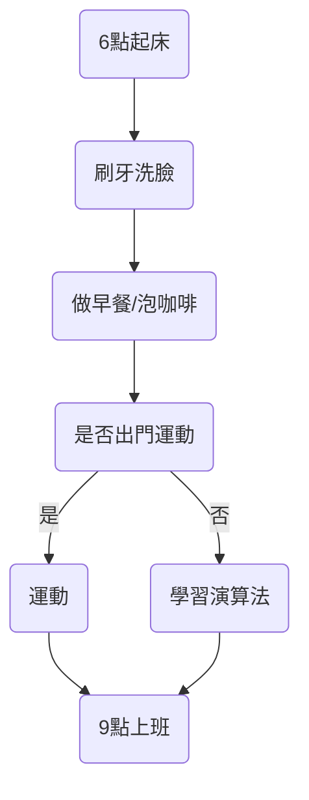
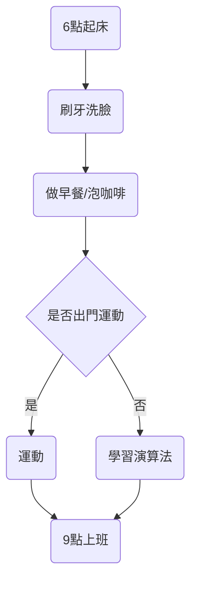
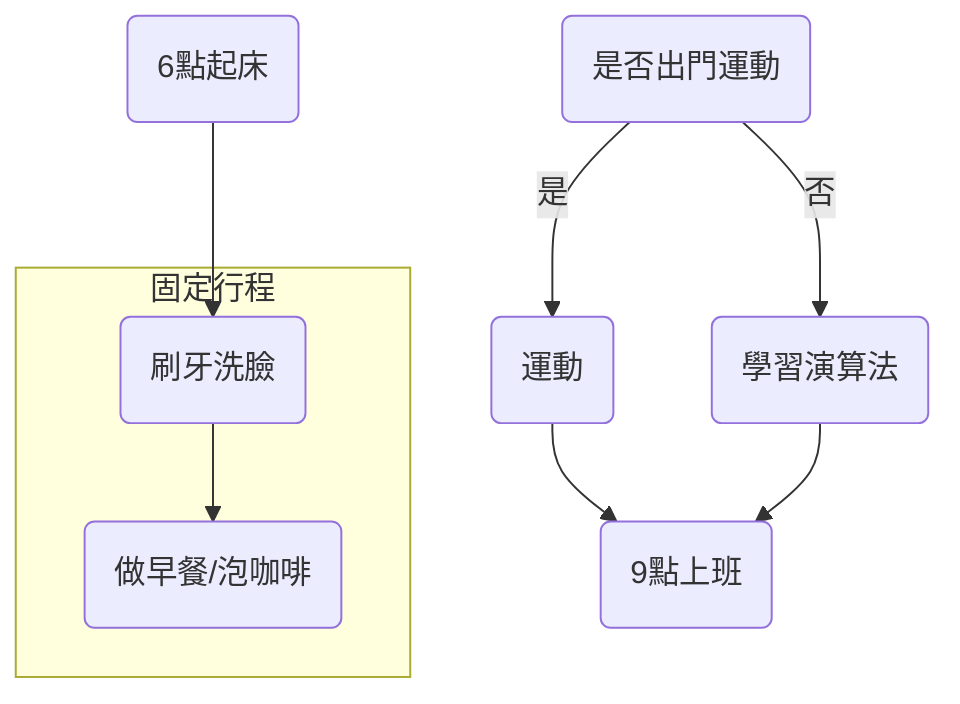
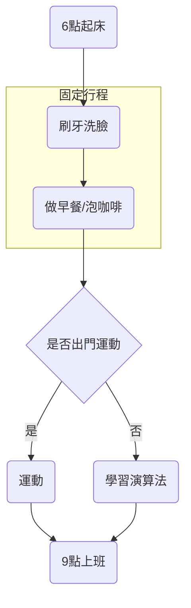

## PM、UI/UX和開發間的需求溝通障礙，造成開發溝通成本過高
近期遇到當開發迭代速度加快且開發人力臨時被抽走，產品經理撰寫的產品需求文件 (PRD) 過於複雜。這導致 UI/UX 團隊難以理解，從而畫出錯誤的使用者介面，或者在開發過程中發現 PRD 中的流程邏輯存在問題。在軟體產品的迭代過程中，使用流程圖作為構思 PRD、團隊溝通和驗收的工具，可以顯著減少事後溝通和修改成本。因此，我們需要一個簡單易懂的流程圖，以幫助我們更好地理解產品需求、溝通和迭代。在這種情況下，ChatGPT 與 Mermaid.js 可以提供一鍵生成流程圖的解決方案。

## ChatGPT 加上 Mermaid.js，一鍵生成流程圖
{{}}

### ChatGPT生成Mermaid.js格式的流程圖
將生成的mermaid格式貼上到線上mermaid editor中，即可生成流程圖。

graph 代表流程圖的類型  
TD 流程圖是由上往下指向  
A(6點起床) --> B(刷牙洗臉) 代表流程圖的節點由A節點指向B節點。    
() 是帶有圓角的方框，是一個操作  
{} 是菱形，是一個判斷  

{{}}

正確的流程圖要把chatGPT生成的mermaid格式的“D(是否出門運動)”改為"D{是否出門運動}"，作為一個判斷的節點。

{{}}

### 加上subgraph，將流程圖分成多個部分，更加清晰
加上subgraph可以將流程圖分成兩多個子圖。  
{{}}  

{{}}

修改一下自動生成的流程圖要把“D(是否出門運動)”改為"D{是否出門運動}"，作為一個判斷的節點。  
將子圖的C指向主圖的D，"C --> D"

{{}}

## 結論
使用流程圖溝通的好處在於，它可以幫助我們更好地理解產品需求、溝通和迭代。  
大大減少溝通成本及不必要的重複工作量。

{{}}

如果將開頭長長的文字用chatGPT加Mermaid.js生成流程圖，會發現總結起來清晰又快速。  

{{}}

## 參考
認識 docsify 文件好幫手 mermaid，簡單畫出 Flowcharts:  
https://medium.com/unalai/%E8%AA%8D%E8%AD%98-docsify-%E6%96%87%E4%BB%B6%E5%A5%BD%E5%B9%AB%E6%89%8B-mermaid-%E7%B0%A1%E5%96%AE%E7%95%AB%E5%87%BA-flowcharts-3b1ac30b1ee1

線上Mermaid Editor推薦:  
1. https://mermaid.live/
2. https://workflow.jace.pro/
